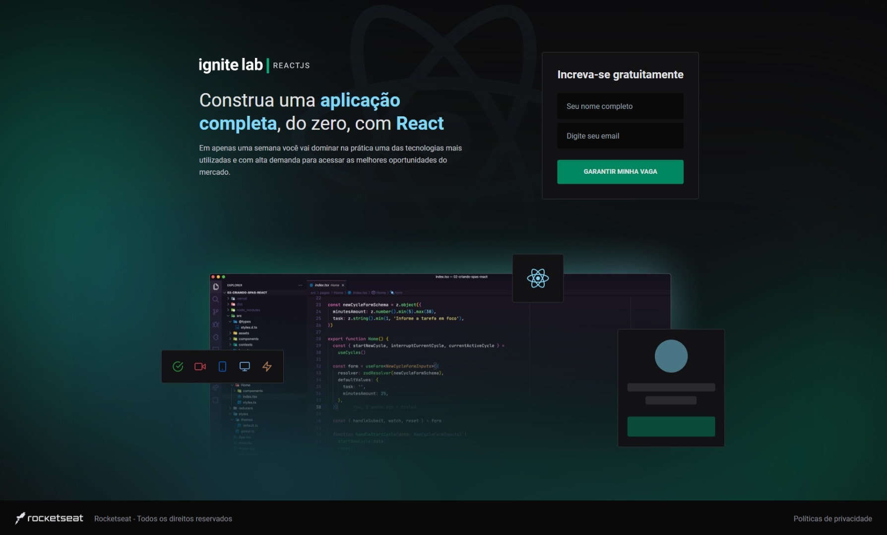
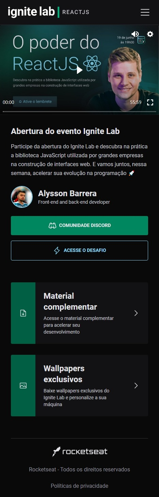
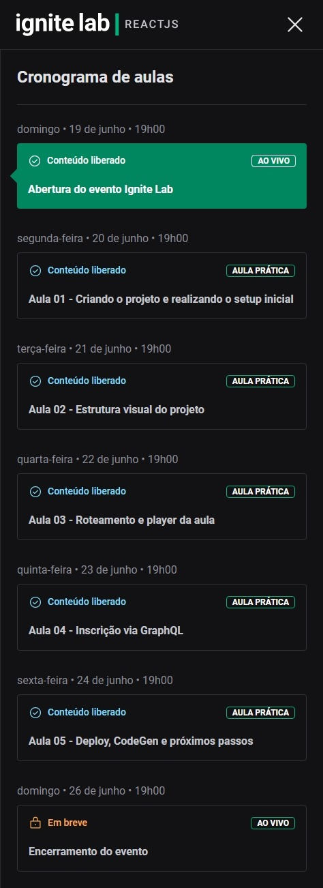
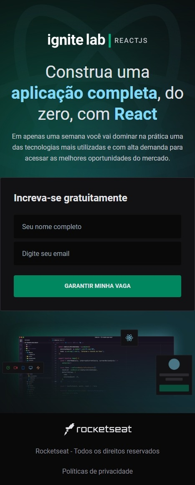

# Event Plataform - Ignite Lab | Rocketseat

## Português

#### Plataforma de eventos desenvolvida durante o ignite lab da Rocketseat

A construção foi feita com base no design disponibilizado através do figma. A aplicação consome uma API do GraphQL que contém lições, professores, inscritos e desafios. Os interessados podem se inscrever e assistir as aulas que são liberadas de acordo com a data e horário estabelecidos.

## English

#### Event platform developed during Rocketseat ignite lab

The construction was made based on the design made available through the figma. The application consumes a GraphQL API that contains lessons, teachers, enrollees, and challenges. Interested parties can register and attend classes that are released according to the date and time set.

## Screenshots

  

    
    
  

  

    
    
    
  

## Videos

https://user-images.githubusercontent.com/86618257/175756993-b1aa635c-ac67-4be9-a90a-6c6015f7df1e.mp4

https://user-images.githubusercontent.com/86618257/175757104-031e307f-9226-41b3-a0c5-0d08775094d7.mp4

  
## Stack

   
